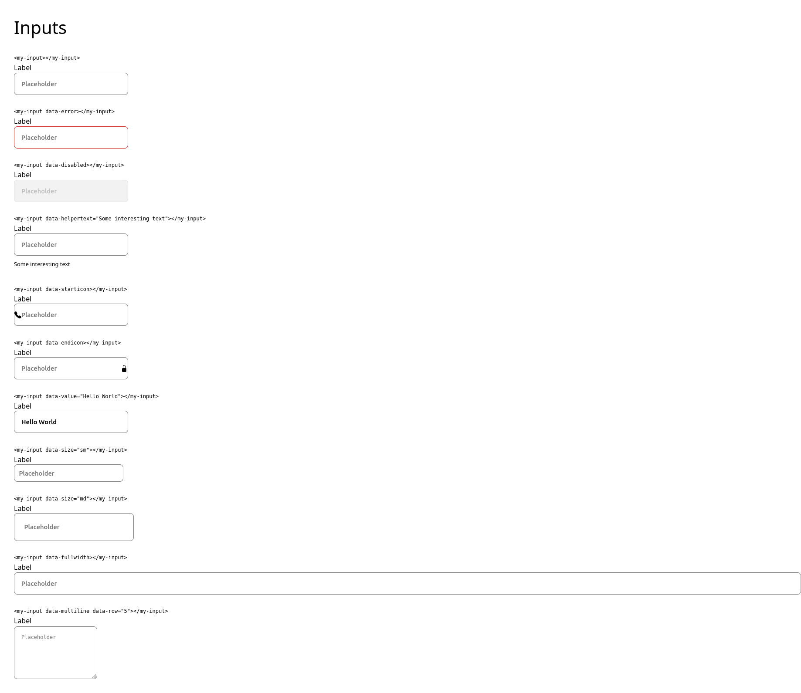

<!-- Please update value in the {}  -->

<h1 align="center">Input component</h1>

	 Solution for a challenge from  <a href="http://devchallenges.io" target="_blank">Devchallenges.io</a>.

	<h3>
		<a href="https://programistazpolski.ct8.pl/devchallenge/input-component-master/">
			Demo
		</a>
		 | 
		<a href="javascript:alert('n/a');">
			Solution
		</a>
		 | 
		<a href="https://devchallenges.io/challenges/TSqutYM4c5WtluM7QzGp">
			Challenge
		</a>
	</h3>

<!-- TABLE OF CONTENTS -->

## Table of Contents

- [Table of Contents](#table-of-contents)
- [Overview](#overview)
- [Features](#features)
- [How To Use](#how-to-use)
- [Contact](#contact)

<!-- OVERVIEW -->

## Overview

A random input component.

## Features

<!-- List the features of your application or follow the template. Don't share the figma file here :) -->

This application/site was created as a submission to a [DevChallenges](https://devchallenges.io/challenges) challenge. The [challenge](https://devchallenges.io/challenges/TSqutYM4c5WtluM7QzGp) was to build an application to complete the given user stories.

## How To Use

Just open the index.html file

## Contact

- Website [programistazpolski.ct8.pl](https://programistazpolski.ct8.pl/)
- GitHub [@ProgramistaZpolski](https://{github.com/ProgramistaZpolski})
- Twitter [@ProgramistaZ](https://twitter.com/ProgramistaZ})
- E-Mail [piotrbadelek@protonmail.com](mailto:piotrbadelek@protonmail.com)